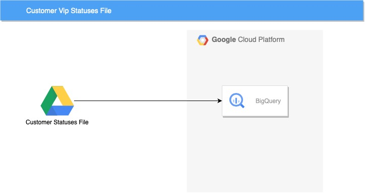

# Nulls handling 
We all know that NULL is a special value (pointer) in SQL. It is used to represent missing or unknown values.
To work with NULLs we have to use special operators and functions. When we use it just by filtering we use IS NULL and IS NOT NULL operators or COALESCE functions. Usually, it is a bit annoying but we handle it.

But there can be situations when we don't expect it and it can cause some problems.
Here is the story begins. 

## The problem. 

We had a simple request from the business to get daily updates about the number of new users on the platform.
We designed a table with the following structure:

| Column | Type | Description |
| --- | --- | --- |
| customer_id | int | Unique identifier of the customer |
| created_at | datetime | Date and time when the customer was created |
| customer_name | varchar(255) | Name of the customer |
| customer_status | varchar(255) | Status of the customer |

The data had been coming from the microservice via Kafka, which was responsible for customer record creation.
So on daily basis, we could get the number of new customers.
The request was quite simple: 

```sql  
SELECT COUNT(*) 
  FROM customers 
 WHERE created_at >= DATEADD(DAY, -1, GETDATE())
```

It worked well for a while. But the business grew up and we got a new requirement. Filter out the VIP and Enterprise customers. This query was for the Marketing Department and they didn't work with VIP customers. So we had to filter out the customers with the following statuses:

```sql
SELECT COUNT(*) 
  FROM customers 
 WHERE created_at >= DATEADD(DAY, -1, GETDATE()) 
   AND customer_status NOT IN ('VIP', 'Enterprise')
```

After a while, we got a new requirement. The VIP department can enrich customer types with new statuses. With the current query, we would have to change hardcoded statuses every time we received a new one. 

That looked like a good candidate to change the approach. We needed to have the ability to filter out customers with statuses that should be excluded. 
The idea was the following: 

> Implement the table with the statuses that should be excluded. This table can be updated by the business. 



To achieve it we created a new table with the following structure: First the table has been populated with the following data:

| category_name |
| --- |
| VIP |
| Enterprise |

So we changed the query to the following:

```sql
SELECT COUNT(*) 
  FROM customers
 WHERE created_at >= DATEADD(DAY, -1, GETDATE()) 
   AND client_category NOT IN 
       (
       SELECT category_name 
         FROM vip_category_list
       )
```

One day new status appeared in the system - "Gold VIP" and the business user updated the Excel file. Unfortunately, there was an empty line in the middle of the file and after the integration part the table values were:


| category_name |
| --- |
| VIP |
| Enterprise |
| null |
| Gold VIP |

The query didn't work anymore. It returned 0 rows.
It happened because of the NULL value in the tuple, which were used in the IN clause. If at least one value in the tuple is NULL, the result of the expression is NULL, and the query returns 0 rows.

A quick fix was to remove the empty line from the Excel file. But it is not a good solution. We need to handle NULLs in the query.

```sql
SELECT COUNT(*) 
  FROM customers
 WHERE created_at >= DATEADD(DAY, -1, GETDATE()) 
   AND client_category NOT IN 
       (
       SELECT category_name 
         FROM vip_category_list
        WHERE category_name IS NOT NULL
       )
```


Of course, we could use COALESCE function to replace NULLs with some value. Also, we can set the default value / non-null for the column.

Another option is to create a service instead of an Excel file. It will be responsible for updating the table. 

## Conclusion

- NULLs are special values in SQL. They are used to represent missing or unknown values. Be careful with NOT IN and other operators, which can return NULLs.
- If you use semi-structured or non-structured data, NULL handling should be done before the final request.
- Think about data quality checks. Here they can be applied after the data has been loaded into the database from an Excel file or in the final table.